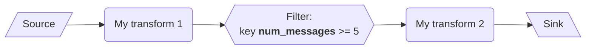
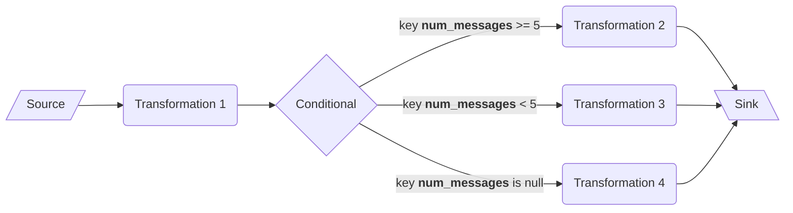

# GlassFlow in Production

## Repo Structure

```
glassflow.yaml                 -- Glassflow configuration file

pipelines/
   pipeline-x/
      pipeline.yaml            -- Pipeline configuration
      common/                  -- Directory with common python code shared by all the steps
      functions/               -- Directory with pipeline functions (folder name == function_id) 
         function-x/
            handler.py
            requirements.txt

tests/
   pipelines/
      pipeline_x/
         test_step_x.py        -- Unit test for step x
         test_pipeline_x.py    -- integration test for pipeline x (use SDK to test already created pipeline)

.github/
   workflows/
```

## Pipeline YAML specification 


```yaml
name:
pipeline_id: # if not defined, pipeline will be created by CI/CD
space_id:
    
blocks:
  - id: my_source
    name: My Source
    type: source
    kind: 
    config:
    next_block_id: my_transform
  - id: my_transform
    name: My transform # default: <id>
    type: transform
    requirements: # default: steps/<step_id>/requirements.py
    handler: # default: steps/<step_id>/handler.py
    next_block_id: sink
  - id: my_sink
    name: My sink
    type: sink
    kind:
    config:
```

### Restrictions

- A pipeline can only have one source and one sink (for now)
- The graph of functions can not have any cycle
- Blocks without output are allowed but will trigger a warning
- Blocks without input are not possible

### Blocks

A block represents the smallest work unit at GlassFlow. They consist of an input queue, some python code and output channels.

#### Transformation

This type of block consists of one input and one output and a python code:

```yaml
  - id:
    name:
    type: transform
    next_block_id:
    env_vars:
      - name:
        value:
    requirements:
        path:   # path to file with requirements.txt file
        value:  # requirements.txt file value
    files:
      - name:
        value:  # Code
        path:   # path to file with code
```

#### Conditional

This block type, sends the events to different blocks depending on a list of conditions.

```yaml
  - id:
    name:
    type: conditional
    branches:
      - block_id:
        filter:
          - key:
            operator:
            value:
            dtype:
```
#### Filter

This block filters out events between blocks:

```yaml
  - id:
    name:
    type: filter
    next_block_id:
    filter:
      - key:
        operator:
        value:
        dtype:
```

#### Source

Source block

```yaml
  - id:
    name:
    type: source
    next_blok_id:
    kind:
    config:
```

#### Sink

Sink block

```yaml
  - id:
    name:
    type: sink
    kind:
    config:
```

### Examples

#### Sequential pipeline with filtering block

```yaml
name:
pipeline_id: # if not defined, pipeline will be created by CI/CD
space_id:
    
blocks:
  - id: my_postgres
    name: My Postgres Source
    type: source
    kind: postgres
    config:
      host:
      db_user:
      db_pass:
      db_name:
    next_block_id: my_transform_1
    
  - id: my_transform_1
    name: My transform 1 # default: <id>
    type: transform
    requirements: # default: steps/<step_id>/requirements.py
    handler: # default: steps/<step_id>/handler.py
    next_block_id: my_filter
    
  - id: my_filter
    name: My filter # default: <id>
    type: filter
    filter:
      - key: num_messages
        operator: ge
        value: 5
        dtype: int
    next_block_id: my_transform_2
    
  - id: my_transform_2
    name: My transform 2 # default: <id>
    type: transform
    requirements: # default: steps/<step_id>/requirements.py
    handler: # default: steps/<step_id>/handler.py
    next_block_id: my_sink
    
  - id: my_sink
    name: My sink
    type: sink
    kind: webhook
    config:
      method: POST
      url: www.mywebhookurl.com
```



#### Complex pipeline

```yaml
name:
pipeline_id: # if not defined, pipeline will be created by CI/CD
space_id:
    
blocks:
  - id: my_postgres
    name: My Postgres Source
    type: source
    kind: postgres
    config:
      host:
      db_user:
      db_pass:
      db_name:
    next_block_id: my_transform_1
    
  - id: my_transform_1
    name: My transform 1 # default: <id>
    type: transform
    requirements: # default: steps/<step_id>/requirements.py
    handler: # default: steps/<step_id>/handler.py
    next_block_id: my_filter
    
  - id: my_condition
    name: Condition # default: <id>
    type: conditional
    branches:
      - block_id: my_transform_2
        filter:
          - key: num_messages
            operator: ge
            value: 5
            dtype: int
      - block_id: my_transform_3
        filter:
          - key: num_messages
            operator: lt
            value: 5
            dtype: int
      - block_id: my_transform_4
        filter:
          - key: num_messages
            operator: is_null
            dtype: int
    
  - id: my_transform_2
    name: My transform 2 # default: <id>
    type: transform
    requirements: # default: steps/<step_id>/requirements.py
    handler: # default: steps/<step_id>/handler.py
    next_block_id: my_sink
  - id: my_transform_3
    name: My transform 3 # default: <id>
    type: transform
    requirements: # default: steps/<step_id>/requirements.py
    handler: # default: steps/<step_id>/handler.py
    next_block_id: my_sink
  - id: my_transform_4
    name: My transform 4 # default: <id>
    type: transform
    requirements: # default: steps/<step_id>/requirements.py
    handler: # default: steps/<step_id>/handler.py
    next_block_id: my_sink
  - id: my_sink
    name: My sink
    type: sink
    kind:
    config:
```



## GlassFlow YAML specification

Probably not yet needed as we don't have many global settings. 

```yaml
organization_id:
```
