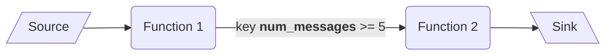
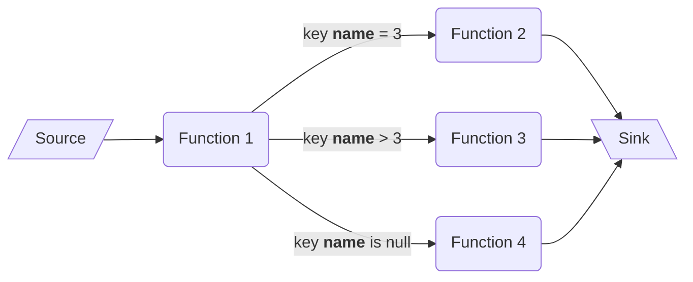

# GlassFlow in Production

## Repo Structure

```
glassflow.yaml                 -- Glassflow configuration file

pipelines/
   pipeline-x/
      pipeline.yaml            -- Pipeline configuration
      common/                  -- Directory with common python code shared by all the steps
      functions/               -- Directory with pipeline functions (folder name == function_id) 
         function-x/
            handler.py
            requirements.txt

tests/
   pipelines/
      pipeline_x/
         test_step_x.py        -- Unit test for step x
         test_pipeline_x.py    -- integration test for pipeline x (use SDK to test already created pipeline)

.github/
   workflows/
```

## Pipeline YAML specification 


```yaml
name:
pipeline_id: # if not defined, pipeline will be created by CI/CD
space_id:

source:
  kind:
  config:

sink:
  kind:
  config:

environment:
  - name:
    value:
    
functions:
  - id:
    name: # default: <id>
    requirements: # default: steps/<step_id>/requirements.py
    handler: # default: steps/<step_id>/handler.py
    output:
      operator: # default: sink

```

### Outputs

#### Sequential

This is the default output type. If not provided in the YAML, we will assume the
functions output is the next function from the list of functions in the YAML 
(or the sink if it's the last function).

```yaml
functions:
  - id: fn_1
    name: Function 1
    output:
      operator: sequential
      filter-conditions:  # Optional
        - key: num_messages
          value: 5
          operator: ">="
      function_id: fn_2
  - id: fn_2
    name: Function 2
    output:
      operator: sink
```



#### Branching

```yaml
functions:
  - id: fn_1
    name: Function 1
    output:
      operator: branch
      branching-conditions:
        - function_id: fn_2
          key: name
          value: 3
          operation: eq
        - function_id: fn_3
          key: name
          value: 3
          operation: gt
        - function_id: fn_4
          key: name
          operation: is_null
  - id: fn_2
    name: Function 2
    output:
      operator: sink
  - id: fn_3
    name: Function 3
    output:
      operator: sink
  - id: fn_4
    name: Function 4
    output:
      operator: sink
```



### Multiple inputs and outputs

Each function can consume events from multiple inputs and publish them to multiple outputs (replicate events and send them to different outputs).

## GlassFlow YAML specification

Probably not yet needed as we don't have many global settings. 

```yaml
organization_id:
```
