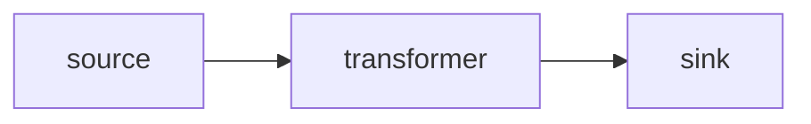

# GlassFlow Pipelines Repository Template

The purpose of this repo is to showcase how to write and maintain GlassFlow data pipelines in production.


## Pipeline YAML specification 

> [!NOTE]  
> A pipeline consists on three components: source, transformer and sink. All three components are required to define a pipeline.
> For now, we can only define one of each type and connect them sequentially (source -> transformer -> sink)

```yaml
# Pipeline Name
name: My First Pipeline  # required

# Pipeline ID - only accessible once pipeline has been created
# if not defined, pipeline will be created by CI/CD
pipeline_id:

# Space ID where to create the pipeline
space_id:  # required

components:
  - id: my_source
    name: My Source
    type: source
    kind: amazon_sqs
    config:
      queue_url: my-sqs-queue-url
      aws_region: eu-central-1
      aws_access_key: my-aws-access-key
      aws_secret_key: my-aws-secret-key
    
  - id: my_transformer
    name: My transformer
    type: transformer
    requirements:
      path: path/to/requirements.txt
    transformation:
      path: path/to/handler.py
    inputs:
      - my_source
    
  - id: my_sink
    name: My sink
    type: sink
    kind: webhook
    config:
      method: POST
      url: www.my-webhook-url.com
      headers:
        - name: Content-Type
          value: application/json
    inputs:
      - my_transformer
```

## Pipeline Components




### Transformer

The transformer component transforms passing events with a python transformation.

```yaml
  - id: transformer-id    # required
    name: 
    type: transformer     # required
    
    # List of inputs components to source events from. 
    # In current version, only events from a source component are accepted
    inputs:               # required
      - <component_id>
    
    # List of Environment Variables to pass to the transformer
    env_vars:
      - name:
        value:
    
    # Python dependency requirements for the transformer
    requirements:
      
      # Path to requirements.txt file
      path:
        
      # Value of requirements.txt
      value:
      
    # Python code with transformation code 
    # (must have a function with definition handler(data, log: logging.Logger) )
    transformation:  # required
      
      # Path to python code
      path: 
        
      # Python code
      value: 
```

### Source

Source connector components ingest data from a source and queue events for the rest of the pipeline to consume. Source connectors are managed by GlassFlow.


```yaml
  - id: source-id         # required
    name:
    type: source          # required
    
    # Kind of source (e.g. amazon_sqs)
    kind:                 # required
    
    # Source configuration parameter
    config:               # required
```


#### List of supported sources:

|  Source Name   | type          | Documentation                                                  |
|:--------------:|---------------|----------------------------------------------------------------| 
| Google Pub/Sub | google_pubsub | [Link](https://www.glassflow.dev/integrations/google-pub-sub)  |
|   Amazon SQS   | amazon_sqs    | [Link](https://www.glassflow.dev/integrations/amazon-sqs)      |
|  Postgres CDC  | postgres      | [Link](https://www.glassflow.dev/integrations/postgres-source) |


### Sink

Sink connector component push events from the pipeline into a sink. 

```yaml
  - id:                 # required
    name:
    type: sink          # required
    
    # Kind of sink (e.g. webhook)
    kind:               # required
    
    # Sink configuration parameters
    config:             # required
    
    # List of inputs components to source events from. 
    # In current version, only events from a transformer component are accepted
    inputs:             # required
      - <component_id>
```

#### List of supported sinks:

| Source Name | type               | Documentation                                               |
|:-----------:|--------------------|-------------------------------------------------------------| 
| Clickhouse  | clickhouse         | [Link](https://www.glassflow.dev/integrations/clickhouse)   |
|  Snowflake  | snowflake_cdc_json | [Link](https://www.glassflow.dev/integrations/snowflake)    |
|   Webhook   | webhook            | [Link](https://www.glassflow.dev/integrations/webhook-sink) |
|   AWS S3    | amazon_s3          | [Link](https://www.glassflow.dev/integrations/amazon-s3)    |
|  Pinecone   | pinecone_json      | -                                                           |
|   MongoDB   | mongodb_json       | -                                                           |

